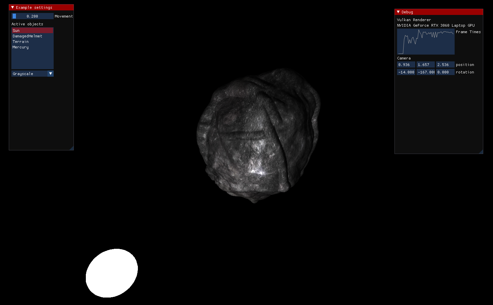

# Vulkan Renderer

## Table of Contents

- [Installation](#installation)
- [Usage](#usage)
- [Support](#support)
- [Contributing](#contributing)

## Installation
Prerequisites:
Vulkan development package.

Download to your project directory.
Look into setup.sh for installation

## Purpose

Vulkan Renderer
Playing around with vulkan while attempting to implement a PBR-pipeline from scratch.

### High Res mesh loaded, (120 mb with phong lightning + normal map)

  
  

## Support

Please [open an issue] for support.

## Contributing

Please contribute using [Github Flow](https://guides.github.com/introduction/flow/). Create a branch, add commits, and [open a pull request].
